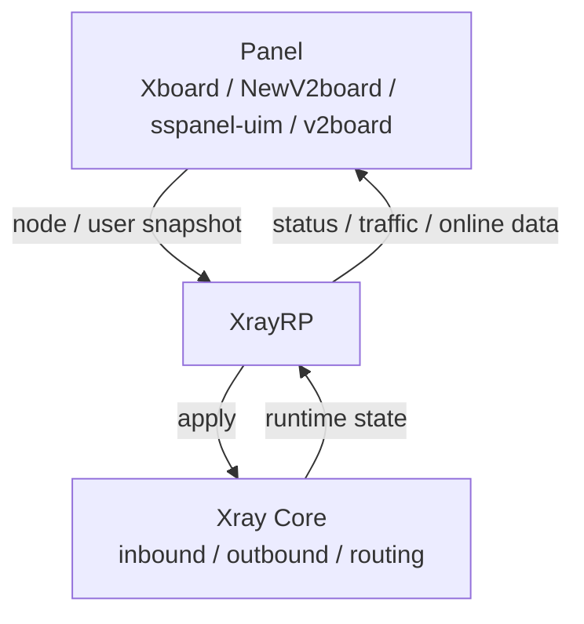

# XrayRP

A **panel-managed Xray runtime framework**: the panel delivers node and user configuration, XrayRP converges it into running Xray instances locally, and reports runtime observations back to the panel.

Current release: `0.9.3` (see [CHANGELOG.md](./CHANGELOG.md))

[](https://github.com/Mtoly/XrayRP/actions/workflows/release.yml)
[](https://github.com/Mtoly/XrayRP/actions/workflows/docker.yml)
[](https://github.com/Mtoly/XrayRP/actions/workflows/test.yml)
[](./LICENSE)

[中文](./README.md) | [فارسی](./README_Fa.md) | [Tiếng Việt](./README-vi.md)

- Panel operators: Xboard / NewV2board, sspanel-uim, v2board and similar panels deliver configuration; XrayRP owns node lifecycle and reporting.
- Self-hosted node maintainers: one instance serves multiple panels and nodes; choose static `Nodes` mode or machine mode as needed.
- Contributors and reviewers: release artifacts, CI gates and runtime observability are all reachable from this file and the linked documents.

See the [architecture document](./docs/architecture.md) and the [Xboard / NewV2board compatibility document](./docs/xboard-newv2board.md) for details.

## Features

### Panel & Control Plane

- Xboard / NewV2board: integrate Xboard and NewV2board through the `NewV2board` adapter.
- Machine Mode: `MachineConfig` authenticates with `MachineID` + `Token`; one instance discovers the nodes bound to this machine and starts and stops them dynamically.
- Node discovery: in machine mode, nodes are discovered periodically from the panel-provided `base_config.pull_interval` (30-second minimum; `DiscoveryInterval` is used when it is absent).
- WebSocket sync: machine mode shares one WebSocket connection for `sync.nodes` and routes messages by `node_id`; after a disconnect it reconnects using `ReconnectBackoff`, and `ResyncOnReconnect` triggers a full resync. Ordinary Xray nodes report as `kind="controller"`, while AnyTLS / TUIC / Hysteria2 use their own `kind` with `websocket="disabled"`, because they receive node-scoped triggers without owning the connection.
- Convergence semantics: polling, WebSocket, reconnect and manual triggers converge on the same sync and apply path; a candidate configuration becomes the Applied value only after the runtime apply succeeds.

### Protocols & Transports

- VLESS (including REALITY / XHTTP / WS / gRPC / HTTPUpgrade)
- VMess
- Trojan
- Shadowsocks (including Shadowsocks-Plugin)
- AnyTLS (specialized runtime, uses the panel-provided `padding_scheme`)
- TUIC (specialized runtime, requires local certificate configuration)
- Hysteria2 (specialized runtime, requires local certificate configuration)

The full node type list and the other transports (including Socks and HTTP) are documented in the `NodeType` comment of [config.yml.example](./release/config/config.yml.example).

### Advanced VLESS

- VLESS Encryption: Xboard delivers the server-side key in the top-level `decryption` field of `/api/v2/server/config`, and XrayRP passes it through to the Xray-core inbound unchanged; a missing, `null` or blank value stays `none`. While encrypted decryption is enabled, Xray-core does not allow inbound fallbacks, so they must be disabled.
- XTLS Vision: when the panel sends `xtls-rprx-vision`, unencrypted VLESS only honors it for direct TCP TLS / REALITY, and it is cleared for other transports.
- XHTTP / WS / gRPC: when server-side VLESS Encryption is in effect (`decryption` non-empty and not `none`), XrayRP no longer clears `xtls-rprx-vision` per transport and keeps the panel-provided value. XrayRP never adds the flow by itself.

### Operations

- User traffic statistics and node status reporting; the report endpoint fallback chain is documented in the compatibility guide.
- Online IP limits, online user limits, node port speed limits and per-user speed limits; an optional Redis global device cache coordinates multiple instances.
- Automatic certificate issuance and renewal (`common/mylego`, supporting ACME DNS/HTTP/TLS and custom files).
- Custom DNS, routing and audit rules (`DnsConfigPath`, `RouteConfigPath`, `RuleListPath`).
- Observability: optional local `/livez`, `/readyz` and `/metrics` (the `Observability` configuration, disabled by default and restricted to loopback or private addresses) exposing metrics such as `xrayrp_runtime_state`.
- Hot reload: configuration changes reload a candidate configuration and replace the running instance only after validation and apply succeed.

### Release & Security

- CodeQL static analysis (`codeql-analysis.yml`, on push / PR / weekly schedule).
- govulncheck reachable-vulnerability scanning, with only a documented exception that carries a version floor (`test.yml`).
- Dependabot updates for dependencies and base images.
- Signed release artifacts: the release page provides the per-platform archives and `SHA256SUMS`, together with the `SHA256SUMS.sigstore.json` Sigstore signature.
- SPDX SBOMs, the release manifest and provenance attestations are produced by the release workflow and retained as workflow evidence.
- Docker PR validation: PRs that touch the `Dockerfile` or the docker workflows build the image and run the `version` smoke test (`docker-test.yml`).

## Architecture



- Panel: delivers nodes, users, routing and audit rules, and receives reports.
- XrayRP: converges panel snapshots into local runtime state; owns runtime lifecycle (start, readiness, stop and reclaim, replacement, failure state), limit and rule enforcement, certificate management, and reporting.
- Xray Core: carries the protocols and transports; XrayRP talks to it through `app/`.

Code locations and invariants are in the [architecture document](./docs/architecture.md).

## Installation

### One-click installation script

```bash
bash <(curl -Ls https://raw.githubusercontent.com/Mtoly/XrayRPS/main/install.sh)
```

### Xboard Machine Mode installation

```bash
bash <(curl -Ls https://raw.githubusercontent.com/Mtoly/XrayRPS/main/install-machine.sh) \
  --api-host https://panel.example.com \
  --machine-id 1 \
  --token "machine-token" \
  --panel-type NewV2board \
  --ws-endpoint "wss://panel.example.com/ws"
```

- The script only writes `MachineConfig` and installs / starts the service. It does not create or register a machine in Xboard, so create and bind the machine in Xboard first.
- `MachineConfig` and static `Nodes` are mutually exclusive; enabling machine mode does not generate static `Nodes`.
- Machine mode does not use handshake discovery. Set `--ws-endpoint` to the address your Xboard `ws-server` is published on (usually `/ws`). When it is omitted, the legacy `<ApiHost>/api/v1/server/UniProxy/ws` path is used, which current Xboard no longer serves.
- If `/etc/XrayR/config.yml` already exists, the script does not overwrite it by default; add `--force` to overwrite.

### Docker (GHCR)

Image: `ghcr.io/mtoly/xrayrp`, published with both the original release tag and `latest`.

```bash
mkdir -p /etc/XrayR
cp release/config/config.yml.example /etc/XrayR/config.yml
# edit /etc/XrayR/config.yml, then start
docker run -d --name xrayrp --restart unless-stopped \
  --network host \
  -v /etc/XrayR:/etc/XrayR \
  ghcr.io/mtoly/xrayrp:latest
```

The container entrypoint is `XrayR --config /etc/XrayR/config.yml`. Listen addresses inside the container come from `ListenIP` in `config.yml`; `Observability.Listen` defaults to `127.0.0.1`, so change it to a private address reachable inside the container and map the port when you need to reach it from outside.

## Configuration

See [release/config/config.yml.example](./release/config/config.yml.example) for the annotated reference covering `Log`, `DnsConfigPath`, `RouteConfigPath`, `ConnectionConfig`, `Observability`, `MachineConfig` and `Nodes`.

- Remote panel addresses (`ApiHost`) must use HTTPS; only loopback development addresses may use HTTP.
- `MachineConfig` and static `Nodes` are alternatives; do not enable both.
- Details are in the [Xboard / NewV2board compatibility document](./docs/xboard-newv2board.md).

## Development

The required Go version is the `go` directive in [go.mod](./go.mod) (currently `1.27`).

```bash
git clone https://github.com/Mtoly/XrayRP.git
cd XrayRP

go build ./...
go test ./...
go vet ./...

# build matching the release artifacts (includes QUIC support)
CGO_ENABLED=0 go build -tags with_quic -o XrayR .
```

## License

[Mozilla Public License Version 2.0](./LICENSE)

## Thanks

- [Project X](https://github.com/XTLS/)
- [V2Fly](https://github.com/v2fly)
- [VNet-V2ray](https://github.com/ProxyPanel/VNet-V2ray)
- [Air-Universe](https://github.com/crossfw/Air-Universe)

## Telegram

- [XrayR discussion group](https://t.me/XrayR_project)
- [XrayR notification channel](https://t.me/XrayR_channel)
