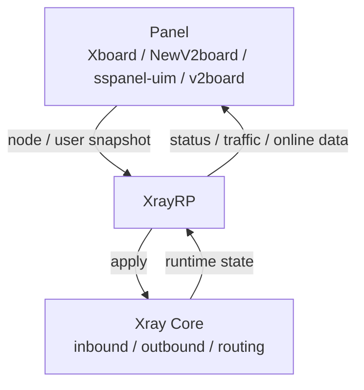

# XrayRP

Một **framework runtime Xray được quản lý bởi panel**: panel gửi cấu hình node và người dùng, XrayRP hội tụ cấu hình đó thành các instance Xray đang chạy cục bộ và báo cáo quan sát runtime trở lại panel.

Phiên bản hiện tại: `0.9.4` (xem [CHANGELOG.md](./CHANGELOG.md))

[](https://github.com/Mtoly/XrayRP/actions/workflows/release.yml)
[](https://github.com/Mtoly/XrayRP/actions/workflows/docker.yml)
[](https://github.com/Mtoly/XrayRP/actions/workflows/test.yml)
[](./LICENSE)

[中文](./README.md) | [English](./README-en.md) | [فارسی](./README_Fa.md)

- Người vận hành panel: các panel như Xboard / NewV2board, sspanel-uim, v2board gửi cấu hình; XrayRP chịu trách nhiệm về vòng đời node và báo cáo.
- Người duy trì node tự dựng: một instance phục vụ nhiều panel và nhiều node; chọn chế độ `Nodes` tĩnh hoặc chế độ máy tùy nhu cầu.
- Người đóng góp và người đánh giá: các thành phần phát hành, cổng CI và khả năng quan sát runtime đều truy cập được từ tệp này và các tài liệu liên kết.

Xem [tài liệu kiến trúc](./docs/architecture.md) và [tài liệu tương thích Xboard / NewV2board](./docs/xboard-newv2board.md) để biết chi tiết.

## Tính năng

### Panel và mặt phẳng điều khiển

- Xboard / NewV2board: tích hợp Xboard và NewV2board qua adapter `NewV2board`.
- Chế độ máy: `MachineConfig` xác thực bằng `MachineID` + `Token`; một instance tự khám phá các node gắn với máy này và khởi động, dừng chúng một cách linh hoạt.
- Khám phá node: ở chế độ máy, node được khám phá định kỳ theo `base_config.pull_interval` do panel gửi xuống (tối thiểu 30 giây; dùng `DiscoveryInterval` khi không có giá trị này).
- Đồng bộ WebSocket: chế độ máy dùng chung một kết nối WebSocket cho `sync.nodes` và định tuyến thông điệp theo `node_id`; sau khi mất kết nối, nó kết nối lại theo `ReconnectBackoff`, và `ResyncOnReconnect` kích hoạt đồng bộ lại toàn bộ. Các node Xray thông thường báo cáo với `kind="controller"`, còn AnyTLS / TUIC / Hysteria2 dùng `kind` riêng với `websocket="disabled"`, vì chúng nhận kích hoạt theo phạm vi node mà không sở hữu kết nối.
- Ngữ nghĩa hội tụ: polling, WebSocket, kết nối lại và kích hoạt thủ công đều hội tụ vào cùng một đường đồng bộ và apply; cấu hình ứng viên chỉ trở thành giá trị Applied sau khi apply runtime thành công.

### Giao thức và truyền tải

- VLESS (bao gồm REALITY / XHTTP / WS / gRPC / HTTPUpgrade)
- VMess
- Trojan
- Shadowsocks (bao gồm Shadowsocks-Plugin)
- AnyTLS (runtime chuyên biệt, dùng `padding_scheme` do panel gửi xuống)
- TUIC (runtime chuyên biệt, cần cấu hình chứng chỉ cục bộ)
- Hysteria2 (runtime chuyên biệt, cần cấu hình chứng chỉ cục bộ)

Danh sách đầy đủ các loại node và các truyền tải khác (bao gồm Socks và HTTP) nằm trong chú thích `NodeType` của [config.yml.example](./release/config/config.yml.example).

### VLESS nâng cao

- Mã hóa VLESS: Xboard gửi khóa phía máy chủ trong trường cấp cao nhất `decryption` của `/api/v2/server/config`, và XrayRP chuyển nguyên trạng cho inbound của Xray-core; giá trị thiếu, `null` hoặc rỗng vẫn giữ là `none`. Khi bật giải mã mã hóa, Xray-core không cho phép fallback inbound, nên cần tắt fallback.
- XTLS Vision: khi panel gửi `xtls-rprx-vision`, VLESS chưa mã hóa chỉ áp dụng nó cho TCP TLS / REALITY trực tiếp, và nó bị xóa với các truyền tải khác.
- XHTTP / WS / gRPC: khi mã hóa VLESS phía máy chủ đang hiệu lực (`decryption` khác rỗng và không phải `none`), XrayRP không còn xóa `xtls-rprx-vision` theo truyền tải mà giữ giá trị do panel gửi. XrayRP không tự thêm flow này.

### Vận hành

- Thống kê lưu lượng người dùng và báo cáo trạng thái node; chuỗi dự phòng endpoint báo cáo được ghi trong tài liệu tương thích.
- Giới hạn IP trực tuyến, giới hạn người dùng trực tuyến, giới hạn tốc độ theo cổng node và theo từng người dùng; bộ đệm thiết bị toàn cục bằng Redis (tùy chọn) phối hợp nhiều instance.
- Cấp và gia hạn chứng chỉ tự động (`common/mylego`, hỗ trợ ACME DNS/HTTP/TLS và tệp tùy chỉnh).
- DNS, định tuyến và quy tắc kiểm toán tùy chỉnh (`DnsConfigPath`, `RouteConfigPath`, `RuleListPath`).
- Khả năng quan sát: các endpoint cục bộ tùy chọn `/livez`, `/readyz` và `/metrics` (cấu hình `Observability`, mặc định tắt và chỉ cho phép địa chỉ loopback hoặc riêng tư) cung cấp các chỉ số như `xrayrp_runtime_state`.
- Tải lại nóng: thay đổi cấu hình sẽ tải cấu hình ứng viên và chỉ thay thế instance đang chạy sau khi xác thực và apply thành công.

### Phát hành và bảo mật

- Phân tích tĩnh CodeQL (`codeql-analysis.yml`, khi push / PR / theo lịch hàng tuần).
- Quét lỗ hổng có thể truy cập bằng govulncheck, chỉ có một ngoại lệ đã được ghi nhận kèm mức sàn phiên bản (`test.yml`).
- Dependabot cập nhật phụ thuộc và image nền.
- Thành phần phát hành đã ký: trang phát hành cung cấp các gói lưu trữ theo nền tảng và `SHA256SUMS`, kèm chữ ký Sigstore trong `SHA256SUMS.sigstore.json`.
- SBOM SPDX, manifest phát hành và provenance attestation do workflow phát hành tạo ra và được giữ lại dưới dạng bằng chứng workflow.
- Kiểm tra Docker trên PR: các PR thay đổi `Dockerfile` hoặc workflow docker sẽ build image và chạy smoke test `version` (`docker-test.yml`).

## Kiến trúc



- Panel: gửi node, người dùng, định tuyến và quy tắc kiểm toán, đồng thời nhận báo cáo.
- XrayRP: hội tụ ảnh chụp panel thành trạng thái runtime cục bộ; sở hữu vòng đời runtime (khởi động, sẵn sàng, dừng và thu hồi, thay thế, trạng thái lỗi), thực thi giới hạn và quy tắc, quản lý chứng chỉ và báo cáo.
- Xray Core: nơi thực sự mang giao thức và truyền tải; XrayRP tương tác qua `app/`.

Vị trí mã nguồn và các bất biến nằm trong [tài liệu kiến trúc](./docs/architecture.md).

## Cài đặt

### Script cài đặt một lần nhấp

```bash
bash <(curl -Ls https://raw.githubusercontent.com/Mtoly/XrayRPS/main/install.sh)
```

### Cài đặt chế độ máy Xboard

```bash
bash <(curl -Ls https://raw.githubusercontent.com/Mtoly/XrayRPS/main/install-machine.sh) \
  --api-host https://panel.example.com \
  --machine-id 1 \
  --token "machine-token" \
  --panel-type NewV2board \
  --ws-endpoint "wss://panel.example.com/ws"
```

- Script chỉ ghi `MachineConfig` và cài đặt / khởi động dịch vụ. Nó không tạo hay đăng ký máy trong Xboard, nên hãy tạo và gắn máy trong Xboard trước.
- `MachineConfig` và `Nodes` tĩnh loại trừ lẫn nhau; bật chế độ máy sẽ không tạo `Nodes` tĩnh.
- Chế độ máy không dùng khám phá handshake. Đặt `--ws-endpoint` thành địa chỉ mà `ws-server` của Xboard được công bố (thường là `/ws`). Khi bỏ trống, đường dẫn cũ `<ApiHost>/api/v1/server/UniProxy/ws` được dùng, mà Xboard hiện tại không còn cung cấp.
- Nếu `/etc/XrayR/config.yml` đã tồn tại, script mặc định không ghi đè; thêm `--force` để ghi đè.

### Docker (GHCR)

Image: `ghcr.io/mtoly/xrayrp`, được phát hành với cả thẻ phát hành gốc và `latest`.

```bash
mkdir -p /etc/XrayR
cp release/config/config.yml.example /etc/XrayR/config.yml
# edit /etc/XrayR/config.yml, then start
docker run -d --name xrayrp --restart unless-stopped \
  --network host \
  -v /etc/XrayR:/etc/XrayR \
  ghcr.io/mtoly/xrayrp:latest
```

Entrypoint của container là `XrayR --config /etc/XrayR/config.yml`. Địa chỉ lắng nghe trong container lấy từ `ListenIP` trong `config.yml`; `Observability.Listen` mặc định là `127.0.0.1`, nên hãy đổi thành một địa chỉ riêng tư truy cập được trong container và ánh xạ cổng khi cần truy cập từ bên ngoài.

## Cấu hình

Tham chiếu có chú thích: [release/config/config.yml.example](./release/config/config.yml.example), bao gồm `Log`, `DnsConfigPath`, `RouteConfigPath`, `ConnectionConfig`, `Observability`, `MachineConfig` và `Nodes`.

- Địa chỉ panel từ xa (`ApiHost`) phải dùng HTTPS; chỉ địa chỉ phát triển loopback mới được dùng HTTP.
- `MachineConfig` và `Nodes` tĩnh là hai lựa chọn thay thế; không bật cả hai.
- Chi tiết nằm trong [tài liệu tương thích Xboard / NewV2board](./docs/xboard-newv2board.md).

## Phát triển

Phiên bản Go yêu cầu là chỉ thị `go` trong [go.mod](./go.mod) (hiện tại `1.27`).

```bash
git clone https://github.com/Mtoly/XrayRP.git
cd XrayRP

go build ./...
go test ./...
go vet ./...

# build matching the release artifacts (includes QUIC support)
CGO_ENABLED=0 go build -tags with_quic -o XrayR .
```

## Giấy phép

[Mozilla Public License Version 2.0](./LICENSE)

## Cảm ơn

- [Project X](https://github.com/XTLS/)
- [V2Fly](https://github.com/v2fly)
- [VNet-V2ray](https://github.com/ProxyPanel/VNet-V2ray)
- [Air-Universe](https://github.com/crossfw/Air-Universe)

## Telegram

- [Nhóm thảo luận XrayR](https://t.me/XrayR_project)
- [Kênh thông báo XrayR](https://t.me/XrayR_channel)
