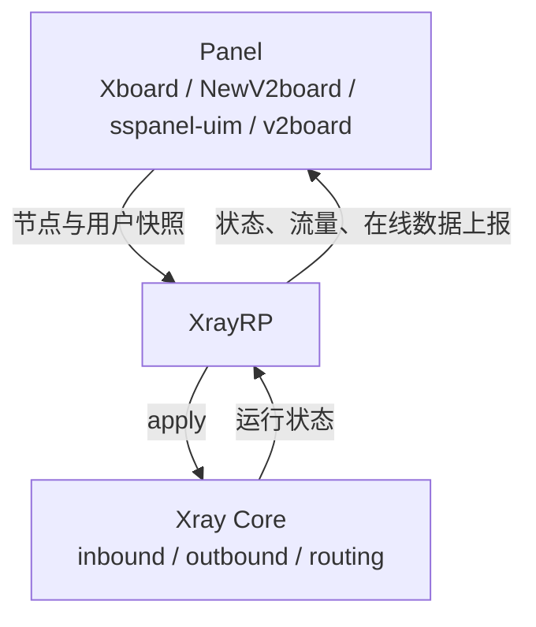

# XrayRP

用面板管理你自己的 Xray 节点。面板负责管理节点与用户，Xray Core 负责运行，XrayRP 负责把两者连接起来：让面板下发的配置在服务器上真正跑起来，并把状态、流量和在线数据回报给面板。

当前版本：`0.9.5`（见 [CHANGELOG.md](./CHANGELOG.md)）

[](https://github.com/Mtoly/XrayRP/stargazers)
[](https://github.com/Mtoly/XrayRP/actions/workflows/release.yml)
[](https://github.com/Mtoly/XrayRP/actions/workflows/docker.yml)
[](https://github.com/Mtoly/XrayRP/actions/workflows/test.yml)
[](./LICENSE)

[English](./README-en.md) | [فارسی](./README_Fa.md) | [Tiếng Việt](./README-vi.md)

## 为什么用 XrayRP

如果你在自己的服务器上运行节点，又不想逐个手工维护配置和进程，XrayRP 会把面板里的配置应用到节点机，并把运行状态和流量信息回报给面板。日常的节点和用户配置由面板管理，减少手工维护节点配置的工作。底层流量由 Xray Core 和对应协议运行时处理。

开始之前，你需要一个已配置好节点的面板，以及节点机的 root 权限。

详细说明见 [架构文档](./docs/architecture.md) 与 [Xboard / NewV2board 兼容性文档](./docs/xboard-newv2board.md)。

## 功能

### 面板与节点管理

- **Xboard / NewV2board**：通过 `NewV2board` 适配器对接 Xboard 与 NewV2board。
- **Machine Mode**：`MachineConfig` 使用 `MachineID` + `Token` 对接，单实例自动发现本机器绑定的节点并动态启停。
- **节点自动同步**：轮询与 WebSocket 触发合并到同一条同步路径，配置变更在运行时应用成功后才会生效；WebSocket 断开后自动重连。
- **保持上次可用状态**：配置热重载时，新配置校验或应用失败不会替换当前正在运行的配置。
- **静态 `Nodes` 模式**：节点写在配置文件里，不依赖面板发现；与 Machine Mode 二选一。

### 协议与传输

- VLESS（含 REALITY / XHTTP / WS / gRPC / HTTPUpgrade / VLESS Encryption）
- VMess
- Trojan
- Shadowsocks（含 Shadowsocks-Plugin）
- AnyTLS（使用面板下发的 `padding_scheme`）
- TUIC（需要本地证书配置）
- Hysteria2（需要本地证书配置）

节点类型清单与其他传输能力（含 Socks、HTTP）见 [config.yml.example](./release/config/config.yml.example) 中的 `NodeType` 注释。

### VLESS Encryption 与 Vision

- **VLESS Encryption**：把 Xboard 下发的服务端密钥交给 Xray-core；加密节点需要关闭 inbound fallback。
- **XTLS Vision**：支持面板下发的 `xtls-rprx-vision`。传输与加密组合的具体行为见[兼容性文档](./docs/xboard-newv2board.md)。

### 运维

- 用户流量统计与节点状态上报。
- 在线 IP 限制、在线用户限制、节点端口限速、用户限速；可选 Redis 全局设备缓存用于多实例协同。
- 证书自动申请与续签，支持 ACME DNS/HTTP/TLS 等方式与自定义文件。
- 自定义 DNS、路由与审计规则。
- 可观测性：可选的本地 `/livez`、`/readyz`、`/metrics`（`Observability` 配置，默认关闭且仅允许回环或私有地址），输出 `xrayrp_runtime_state` 等指标。
- 热重载：配置变更后重新加载候选配置，在校验与 apply 成功后才替换运行中的实例。

### 发布与安全

- CodeQL 静态分析（`codeql-analysis.yml`，push / PR / 每周计划）。
- govulncheck 可达漏洞扫描，仅允许已被记录并有版本下限约束的例外（`test.yml`）。
- Dependabot 依赖与基础镜像更新。
- 签名发布产物：发布页提供各平台归档与 `SHA256SUMS`，并附带 `SHA256SUMS.sigstore.json` Sigstore 签名。
- SPDX SBOM、发布清单与 provenance attestation 由发布工作流生成，并作为 workflow evidence 保留。
- Docker PR 验证：改动 `Dockerfile` 或 docker workflow 的 PR 会构建镜像并执行 `version` 冒烟测试（`docker-test.yml`）。

## 架构



- Panel：下发节点、用户、路由与审计规则，并接收上报。
- XrayRP：把面板快照收敛为本地运行状态，负责运行时生命周期（启动、就绪、停止与回收、替换、失败状态）、限速与规则执行、证书管理，以及上报。
- Xray Core：实际承载协议与传输，XrayRP 通过 `app/` 与其交互。

代码位置与不变量见 [架构文档](./docs/architecture.md)。

## 安装

### 一键安装脚本

```bash
bash <(curl -Ls https://raw.githubusercontent.com/Mtoly/XrayRPS/main/install.sh)
```

### Xboard Machine Mode 安装

```bash
bash <(curl -Ls https://raw.githubusercontent.com/Mtoly/XrayRPS/main/install-machine.sh) \
  --api-host https://panel.example.com \
  --machine-id 1 \
  --token "machine-token" \
  --panel-type NewV2board \
  --ws-endpoint "wss://panel.example.com/ws"
```

- 该脚本只生成 `MachineConfig` 并安装 / 启动服务，不会在 Xboard 中创建或注册机器，请先在 Xboard 创建 / 绑定机器。
- `MachineConfig` 与静态 `Nodes` 互斥；启用机器模式时不会生成静态 `Nodes`。
- 机器模式不使用 handshake 自动发现，请用 `--ws-endpoint` 显式填写 Xboard `ws-server` 对外地址（通常为 `/ws`）；省略时回退到旧版 `<ApiHost>/api/v1/server/UniProxy/ws`，当前 Xboard 不再提供该路由。
- 已有 `/etc/XrayR/config.yml` 时脚本默认不覆盖，确认覆盖再加 `--force`。

### Docker（GHCR）

镜像：`ghcr.io/mtoly/xrayrp`，发布时同时打上原始 release tag 与 `latest`。

```bash
mkdir -p /etc/XrayR
cp release/config/config.yml.example /etc/XrayR/config.yml
# 编辑 /etc/XrayR/config.yml 后启动
docker run -d --name xrayrp --restart unless-stopped \
  --network host \
  -v /etc/XrayR:/etc/XrayR \
  ghcr.io/mtoly/xrayrp:latest
```

容器入口为 `XrayR --config /etc/XrayR/config.yml`，容器内监听地址由 `config.yml` 的 `ListenIP` 决定；`Observability.Listen` 默认绑定 `127.0.0.1`，需要从容器外访问时请改为容器内可访问的私有地址并映射端口。

## 配置

配置参考 [release/config/config.yml.example](./release/config/config.yml.example)，该文件带逐项注释，覆盖 `Log`、`DnsConfigPath`、`RouteConfigPath`、`ConnectionConfig`、`Observability`、`MachineConfig` 与 `Nodes`。

- 远程面板地址（`ApiHost`）必须使用 HTTPS；仅回环开发地址可以使用 HTTP。
- `MachineConfig` 与静态 `Nodes` 二选一，不能同时启用。
- 细节说明见 [Xboard / NewV2board 兼容性文档](./docs/xboard-newv2board.md)。

## 开发

要求 Go 版本以 [go.mod](./go.mod) 中的 `go` 指令为准（当前为 `1.27`）。

```bash
git clone https://github.com/Mtoly/XrayRP.git
cd XrayRP

go build ./...
go test ./...
go vet ./...

# 与发布产物一致的构建（包含 QUIC 支持）
CGO_ENABLED=0 go build -tags with_quic -o XrayR .
```

## License

[Mozilla Public License Version 2.0](./LICENSE)

## Thanks

- [Project X](https://github.com/XTLS/)
- [V2Fly](https://github.com/v2fly)
- [VNet-V2ray](https://github.com/ProxyPanel/VNet-V2ray)
- [Air-Universe](https://github.com/crossfw/Air-Universe)

## Telegram

- [XrayR 讨论群](https://t.me/XrayR_project)
- [XrayR 通知频道](https://t.me/XrayR_channel)
