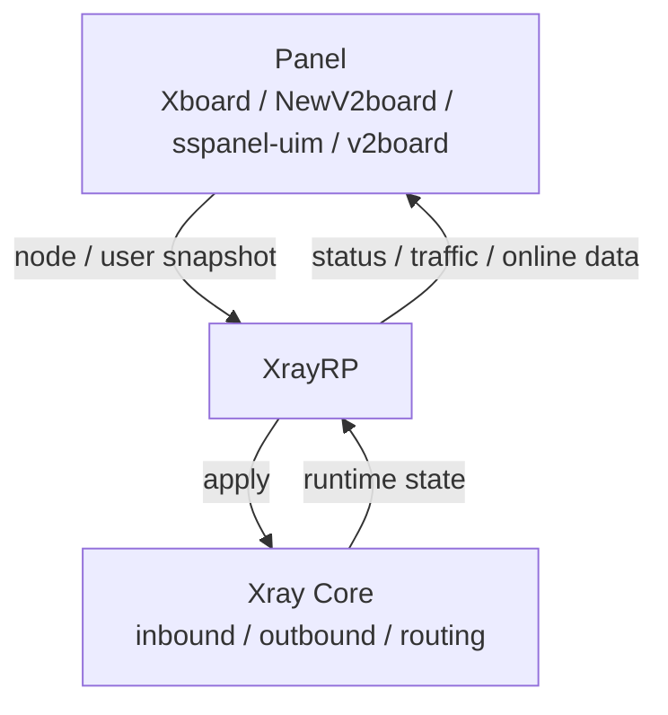

# XrayRP

یک **چارچوب زمان اجرای Xray با مدیریت پنل**: پنل پیکربندی گره‌ها و کاربران را ارسال می‌کند، XrayRP آن را به‌صورت محلی به نمونه‌های در حال اجرای Xray تبدیل می‌کند و مشاهدات زمان اجرا را به پنل گزارش می‌دهد.

نسخه فعلی: `0.9.3` (به [CHANGELOG.md](./CHANGELOG.md) مراجعه کنید)

[](https://github.com/Mtoly/XrayRP/actions/workflows/release.yml)
[](https://github.com/Mtoly/XrayRP/actions/workflows/docker.yml)
[](https://github.com/Mtoly/XrayRP/actions/workflows/test.yml)
[](./LICENSE)

[中文](./README.md) | [English](./README-en.md) | [Tiếng Việt](./README-vi.md)

- اپراتورهای پنل: پنل‌هایی مانند Xboard / NewV2board، sspanel-uim و v2board پیکربندی را ارسال می‌کنند و XrayRP مسئول چرخه عمر گره‌ها و گزارش‌دهی است.
- نگهدارندگان گره‌های سرور شخصی: یک نمونه چند پنل و چند گره را پوشش می‌دهد؛ حالت `Nodes` ثابت یا حالت ماشین را بر اساس نیاز انتخاب کنید.
- مشارکت‌کنندگان و بازبینان: مصنوعات انتشار، دروازه‌های CI و مشاهده‌پذیری زمان اجرا از همین فایل و اسناد مرتبط قابل دسترسی هستند.

برای جزئیات، [سند معماری](./docs/architecture.md) و [سند سازگاری Xboard / NewV2board](./docs/xboard-newv2board.md) را ببینید.

## ویژگی‌ها

### پنل و صفحه کنترل

- Xboard / NewV2board: یکپارچه‌سازی Xboard و NewV2board از طریق آداپتور `NewV2board`.
- حالت ماشین: `MachineConfig` با `MachineID` + `Token` احراز هویت می‌کند؛ یک نمونه گره‌های متصل به این ماشین را کشف و به‌صورت پویا راه‌اندازی و متوقف می‌کند.
- کشف گره: در حالت ماشین، گره‌ها به‌صورت دوره‌ای بر اساس `base_config.pull_interval` ارسالی از پنل کشف می‌شوند (حداقل ۳۰ ثانیه؛ در صورت نبود آن `DiscoveryInterval` استفاده می‌شود).
- همگام‌سازی WebSocket: حالت ماشین یک اتصال WebSocket مشترک را برای `sync.nodes` به کار می‌گیرد و پیام‌ها را بر اساس `node_id` مسیریابی می‌کند؛ پس از قطع اتصال با `ReconnectBackoff` دوباره وصل می‌شود و `ResyncOnReconnect` همگام‌سازی کامل را فعال می‌کند. گره‌های معمولی Xray با `kind="controller"` گزارش می‌شوند، در حالی که AnyTLS / TUIC / Hysteria2 از `kind` مخصوص خود با `websocket="disabled"` استفاده می‌کنند، چون محرک‌های سطح گره را دریافت می‌کنند ولی مالک اتصال نیستند.
- معنای همگرایی: نظرسنجی، WebSocket، اتصال مجدد و محرک دستی به یک مسیر همگام‌سازی و apply واحد می‌رسند؛ پیکربندی کاندید تنها پس از موفقیت apply در زمان اجرا به مقدار Applied تبدیل می‌شود.

### پروتکل‌ها و انتقال‌ها

- VLESS (شامل REALITY / XHTTP / WS / gRPC / HTTPUpgrade)
- VMess
- Trojan
- Shadowsocks (شامل Shadowsocks-Plugin)
- AnyTLS (زمان اجرای تخصصی، از `padding_scheme` ارسالی پنل استفاده می‌کند)
- TUIC (زمان اجرای تخصصی، نیازمند پیکربندی گواهی محلی)
- Hysteria2 (زمان اجرای تخصصی، نیازمند پیکربندی گواهی محلی)

فهرست کامل انواع گره و سایر انتقال‌ها (شامل Socks و HTTP) در توضیح `NodeType` در [config.yml.example](./release/config/config.yml.example) آمده است.

### VLESS پیشرفته

- رمزنگاری VLESS: Xboard کلید سمت سرور را در فیلد سطح بالای `decryption` در `/api/v2/server/config` ارسال می‌کند و XrayRP آن را بدون تغییر به ورودی Xray-core می‌دهد؛ مقدار ناموجود، `null` یا خالی به‌صورت `none` باقی می‌ماند. هنگام فعال بودن رمزگشایی، Xray-core اجازه ترکیب با fallback ورودی را نمی‌دهد، پس باید fallback را غیرفعال کنید.
- XTLS Vision: وقتی پنل `xtls-rprx-vision` را ارسال می‌کند، VLESS رمزنگاری‌نشده فقط برای TCP TLS / REALITY مستقیم آن را اعمال می‌کند و برای سایر انتقال‌ها پاک می‌شود.
- XHTTP / WS / gRPC: وقتی رمزنگاری VLESS سمت سرور فعال است (`decryption` غیرخالی و نه `none`)، XrayRP دیگر `xtls-rprx-vision` را بر اساس انتقال پاک نمی‌کند و مقدار ارسالی پنل را نگه می‌دارد. XrayRP خودش این flow را اضافه نمی‌کند.

### عملیات

- آمار ترافیک کاربران و گزارش وضعیت گره؛ زنجیره بازگشت endpoint گزارش در سند سازگاری توضیح داده شده است.
- محدودیت IP آنلاین، محدودیت کاربر آنلاین، محدودیت سرعت پورت گره و محدودیت سرعت هر کاربر؛ کش دستگاه جهانی Redis (اختیاری) چند نمونه را هماهنگ می‌کند.
- صدور و تمدید خودکار گواهی (`common/mylego`، با پشتیبانی از ACME DNS/HTTP/TLS و فایل‌های سفارشی).
- DNS، مسیریابی و قوانین حسابرسی سفارشی (`DnsConfigPath`، `RouteConfigPath`، `RuleListPath`).
- مشاهده‌پذیری: مسیرهای محلی اختیاری `/livez`، `/readyz` و `/metrics` (پیکربندی `Observability`، به‌صورت پیش‌فرض غیرفعال و محدود به آدرس loopback یا خصوصی) که معیارهایی مانند `xrayrp_runtime_state` را ارائه می‌دهد.
- بارگذاری مجدد گرم: تغییر پیکربندی، یک پیکربندی کاندید را بارگذاری می‌کند و نمونه در حال اجرا تنها پس از موفقیت اعتبارسنجی و apply جایگزین می‌شود.

### انتشار و امنیت

- تحلیل ایستا با CodeQL (`codeql-analysis.yml`، در push / PR / زمان‌بندی هفتگی).
- اسکن آسیب‌پذیری‌های قابل‌دسترس با govulncheck، تنها با یک استثنای مستند که کف نسخه دارد (`test.yml`).
- به‌روزرسانی وابستگی‌ها و ایمیج‌های پایه با Dependabot.
- مصنوعات امضاشده انتشار: صفحه انتشار آرشیوهای هر پلتفرم و `SHA256SUMS` را همراه با امضای Sigstore در `SHA256SUMS.sigstore.json` ارائه می‌دهد.
- SBOM های SPDX، مانیفست انتشار و provenance attestation توسط workflow انتشار تولید و به‌عنوان شواهد workflow نگهداری می‌شوند.
- اعتبارسنجی Docker در PR: PR هایی که `Dockerfile` یا workflow های docker را تغییر می‌دهند، ایمیج را می‌سازند و تست دود `version` را اجرا می‌کنند (`docker-test.yml`).

## معماری



- Panel: گره‌ها، کاربران، مسیریابی و قوانین حسابرسی را ارسال می‌کند و گزارش‌ها را دریافت می‌کند.
- XrayRP: عکس‌های لحظه‌ای پنل را به وضعیت زمان اجرای محلی تبدیل می‌کند؛ مالک چرخه عمر زمان اجرا (شروع، آمادگی، توقف و آزادسازی، جایگزینی، وضعیت خطا)، اعمال محدودیت‌ها و قوانین، مدیریت گواهی و گزارش‌دهی است.
- Xray Core: حامل واقعی پروتکل‌ها و انتقال‌ها است؛ XrayRP از طریق `app/` با آن تعامل می‌کند.

مکان کد و ناورداها در [سند معماری](./docs/architecture.md) آمده است.

## نصب

### اسکریپت نصب یک‌کلیکی

```bash
bash <(curl -Ls https://raw.githubusercontent.com/Mtoly/XrayRPS/main/install.sh)
```

### نصب حالت ماشین Xboard

```bash
bash <(curl -Ls https://raw.githubusercontent.com/Mtoly/XrayRPS/main/install-machine.sh) \
  --api-host https://panel.example.com \
  --machine-id 1 \
  --token "machine-token" \
  --panel-type NewV2board \
  --ws-endpoint "wss://panel.example.com/ws"
```

- این اسکریپت فقط `MachineConfig` را می‌نویسد و سرویس را نصب / اجرا می‌کند. ماشینی در Xboard ایجاد یا ثبت نمی‌کند، پس ابتدا ماشین را در Xboard ایجاد و متصل کنید.
- `MachineConfig` و `Nodes` ثابت متقابلاً انحصاری هستند؛ فعال کردن حالت ماشین، `Nodes` ثابت تولید نمی‌کند.
- حالت ماشین از کشف handshake استفاده نمی‌کند. `--ws-endpoint` را روی آدرسی که `ws-server` در Xboard روی آن منتشر شده است تنظیم کنید (معمولاً `/ws`). در صورت حذف آن، مسیر قدیمی `<ApiHost>/api/v1/server/UniProxy/ws` استفاده می‌شود که Xboard فعلی دیگر ارائه نمی‌کند.
- اگر `/etc/XrayR/config.yml` از قبل وجود داشته باشد، اسکریپت به‌صورت پیش‌فرض آن را بازنویسی نمی‌کند؛ برای بازنویسی `--force` را اضافه کنید.

### داکر (GHCR)

ایمیج: `ghcr.io/mtoly/xrayrp`، همراه با تگ اصلی انتشار و `latest` منتشر می‌شود.

```bash
mkdir -p /etc/XrayR
cp release/config/config.yml.example /etc/XrayR/config.yml
# edit /etc/XrayR/config.yml, then start
docker run -d --name xrayrp --restart unless-stopped \
  --network host \
  -v /etc/XrayR:/etc/XrayR \
  ghcr.io/mtoly/xrayrp:latest
```

ورودی کانتینر `XrayR --config /etc/XrayR/config.yml` است. آدرس‌های شنود داخل کانتینر از `ListenIP` در `config.yml` می‌آید؛ مقدار پیش‌فرض `Observability.Listen` روی `127.0.0.1` است، پس برای دسترسی از بیرون کانتینر آن را به یک آدرس خصوصی قابل‌دسترس در کانتینر تغییر دهید و پورت را نگاشت کنید.

## پیکربندی

مرجع همراه با توضیحات: [release/config/config.yml.example](./release/config/config.yml.example) که `Log`، `DnsConfigPath`، `RouteConfigPath`، `ConnectionConfig`، `Observability`، `MachineConfig` و `Nodes` را پوشش می‌دهد.

- آدرس پنل راه دور (`ApiHost`) باید از HTTPS استفاده کند؛ فقط آدرس‌های توسعه loopback می‌توانند HTTP داشته باشند.
- `MachineConfig` و `Nodes` ثابت دو گزینه جایگزین هستند؛ هر دو را همزمان فعال نکنید.
- جزئیات در [سند سازگاری Xboard / NewV2board](./docs/xboard-newv2board.md) آمده است.

## توسعه

نسخه Go موردنیاز همان دستور `go` در [go.mod](./go.mod) است (اکنون `1.27`).

```bash
git clone https://github.com/Mtoly/XrayRP.git
cd XrayRP

go build ./...
go test ./...
go vet ./...

# build matching the release artifacts (includes QUIC support)
CGO_ENABLED=0 go build -tags with_quic -o XrayR .
```

## مجوز

[Mozilla Public License Version 2.0](./LICENSE)

## قدردانی

- [Project X](https://github.com/XTLS/)
- [V2Fly](https://github.com/v2fly)
- [VNet-V2ray](https://github.com/ProxyPanel/VNet-V2ray)
- [Air-Universe](https://github.com/crossfw/Air-Universe)

## تلگرام

- [گروه بحث XrayR](https://t.me/XrayR_project)
- [کانال اطلاع‌رسانی XrayR](https://t.me/XrayR_channel)
